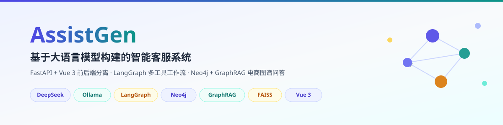
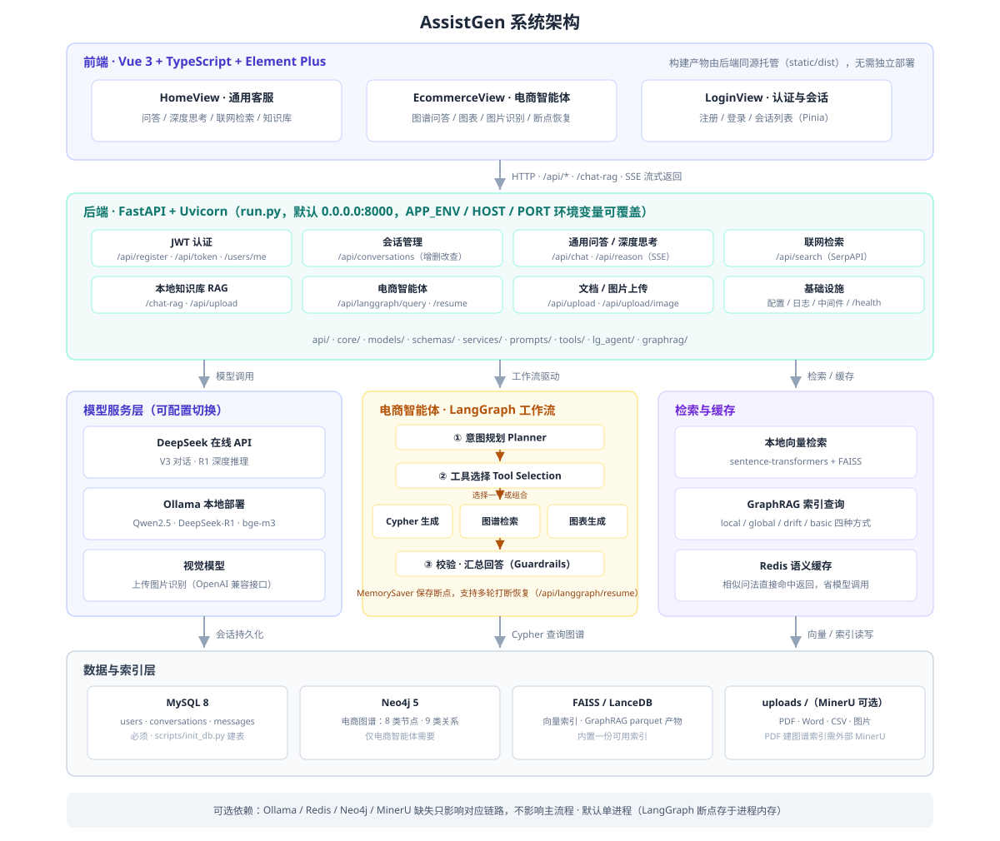

# AssistGen —— 基于大语言模型构建的智能客服系统



一个基于 FastAPI + Vue 3 的前后端分离智能客服系统，覆盖 Agent 与 RAG 在客服场景的主流落地形态。
支持 DeepSeek 在线 API 与本地 Ollama 两类模型服务，包含通用问答、深度思考、联网检索、本地知识库问答，
以及基于 Neo4j + GraphRAG + LangGraph 的电商智能体。

---

## 功能特性

### 1. 通用问答
- 支持 DeepSeek V3 在线 API
- 支持通过 Ollama 接入任意对话模型（Qwen2.5 系列、Llama3 系列等）
- 模型服务可配置切换（`CHAT_SERVICE` / `REASON_SERVICE` / `AGENT_SERVICE`）

### 2. 深度思考
- 支持 DeepSeek R1 在线 API（`DEEPSEEK_REASON_MODEL`）
- 支持 Ollama 本地部署的 DeepSeek R1 系列
- 推理过程与正文分离推送，前端独立面板展示

### 3. 联网检索
- 通过 SerpAPI 实现实时联网搜索（`/api/search`）

### 4. 本地知识库问答（RAG）
- `sentence-transformers` + FAISS 本地向量检索
- 支持上传 PDF / Word 文档自动切分入库
- 基于 Redis 的语义缓存，命中相似问法直接返回，降低模型调用成本

> PDF 走的是两条不同链路，请注意区分：
> ① **本地知识库（本节）**：`embedding_service.py`，`PyPDF2` 直接抽取文字，无需外部服务。
> ② **GraphRAG 图谱索引（第 6 节）**：`settings_pdf.yaml`，依赖外部 **MinerU** 服务解析版面，本仓库不包含它。

### 5. 会话管理
- MySQL 持久化会话与消息（`users` / `conversations` / `messages`）
- 左侧会话列表、改名、删除，问答与深度思考接口均带 `user_id` / `conversation_id` 参数

### 6. 电商智能体（Neo4j + GraphRAG + LangGraph）
- LangGraph 多工具工作流：意图规划 → 工具选择 → Cypher 查询 / 知识图谱检索 / 图表生成
- 支持多轮对话打断恢复（`/api/langgraph/resume`）
- 支持上传图片，由视觉模型识别后进入图谱查询

### 7. Ollama 性能测试工具
单请求性能测试、并发性能测试、系统资源监控、自动化测试报告（`app/test/ollama_benchmark.py`）

---

## 系统架构



整体为四层结构，与下文各章节一一对应：

| 层 | 组成 | 对应章节 |
| --- | --- | --- |
| **前端** | Vue 3 + Element Plus 三大页面（客服 / 电商智能体 / 登录），构建产物由后端同源托管 | [前端开发](#前端开发) |
| **后端** | FastAPI 提供 JWT 认证、会话管理、问答 / 深度思考 / 联网检索 / 知识库 RAG / 电商智能体等接口 | [API 接口](#api-接口) |
| **模型与智能体** | DeepSeek / Ollama 可切换模型服务；LangGraph 工作流（规划 → 选工具 → Cypher / 图谱 / 图表 → 汇总）；FAISS + GraphRAG 检索与 Redis 语义缓存 | [电商智能体](#电商智能体neo4j--graphrag) |
| **数据与索引** | MySQL（会话）、Neo4j（电商图谱）、FAISS / LanceDB（向量与图谱索引）、uploads（MinerU 可选） | [部署](#部署) |

> 图中标注了各外部依赖的可选性：Ollama / Redis / Neo4j / MinerU 缺失只影响对应链路，不影响主流程。

---

## 目录结构

```
ecommerce-agent/
├── llm_backend/                     # 后端（FastAPI）
│   ├── main.py                      # 应用入口与主要路由
│   ├── run.py                       # 启动脚本（默认 8000 端口）
│   ├── .env                         # 本地配置（不入库，需自行创建）
│   ├── app/
│   │   ├── api/                     # 认证路由（/register /token /users/me /validate-token）
│   │   ├── core/                    # 配置、数据库、日志、安全、中间件
│   │   ├── models/                  # SQLAlchemy 模型：User / Conversation / Message
│   │   ├── schemas/                 # Pydantic 请求响应模型
│   │   ├── services/                # 模型调用、检索、缓存、会话等业务服务
│   │   ├── prompts/                 # RAG 与检索的提示词模板
│   │   ├── tools/                   # Function Calling 工具定义
│   │   ├── lg_agent/                # LangGraph 智能体（含 kg_sub_graph 图谱子图）
│   │   ├── graphrag/                # 内置 GraphRAG 项目（索引输入/输出/prompts/settings）
│   │   │   └── data/.env            # 索引用模型配置（不入库，重建索引前需自行创建，见下文）
│   │   └── test/                    # 调试与压测脚本
│   ├── scripts/
│   │   ├── init_db.py               # 建表脚本（默认只建缺失的表）
│   │   └── preflight.py             # 部署前自检
│   ├── static/dist/                 # 前端构建产物（由后端同源托管）
│   └── uploads/                     # 上传文档与图片
├── llm_frontend/                    # 前端（Vue 3 + TypeScript + Element Plus）
│   ├── src/api/                     # 接口封装（http / auth / chat / agent / conversation）
│   ├── src/views/                   # HomeView（客服）/ EcommerceView（电商智能体）/ LoginView
│   ├── src/components/              # 消息气泡、思考面板、来源面板、输入栏等
│   ├── src/stores/                  # Pinia 状态：用户、会话
│   └── vite.config.ts               # 构建输出到后端 static/dist，开发态代理到 8000
├── tests/test_contract.py           # 接口契约与工程规范回归测试
├── pytest.ini                       # pytest 配置
├── requirements.txt                 # 后端依赖
├── .env.example                     # 环境变量模板
├── CHANGELOG.md                     # 版本变更记录
├── docs/                            # 文档配图（banner.svg / architecture.svg）
└── README.md
```

---

## 快速启动

### 0. 环境要求

| 组件 | 版本要求 | 说明 |
| --- | --- | --- |
| Python | **3.11 ~ 3.12（推荐 3.12）** | 依赖里 `graphrag==2.1.0` 要求 `python>=3.10,<3.13`，而 `ipython==9.1.0` 要求 `>=3.11`，两个约束叠加后只有 **3.11 / 3.12** 可用，3.13 及以上会直接安装失败 |
| MySQL | 8.x | 会话与用户数据 |
| Redis | 6.x 及以上 | 语义缓存，未启动时缓存功能不可用但不影响主流程 |
| Neo4j | 5.x | **仅电商智能体需要**，不跑该功能可不装 |
| Node.js | 18 / 20 / 22+（**19、21 不支持**） | 仅在需要重新构建前端时需要；vite 6 的版本约束如此 |
| Ollama | 可选 | 使用本地模型时需要 |

### 1. 安装依赖

在项目根目录 `ecommerce-agent` 下执行：

```bash
python -m venv .venv

# Windows
.venv\Scripts\activate
# Linux / Mac
source .venv/bin/activate

pip install -r requirements.txt
```

> 依赖包含 `torch`、`sentence-transformers`、`graphrag` 等大体积包，首次安装耗时较长。
> 国内网络可加镜像：`pip install -r requirements.txt -i https://pypi.tuna.tsinghua.edu.cn/simple`

### 2. 配置环境变量

复制模板到后端目录，再填入真实值：

```bash
cp .env.example llm_backend/.env     # Windows: copy .env.example llm_backend\.env
```

必填项：

```env
# 模型服务
DEEPSEEK_API_KEY=sk-...            # DeepSeek 控制台申请
DEEPSEEK_BASE_URL=https://api.deepseek.com
DEEPSEEK_MODEL=deepseek-chat
DEEPSEEK_REASON_MODEL=deepseek-reasoner

# 视觉模型（图片识别用，可复用其他 OpenAI 兼容服务）
VISION_API_KEY=sk-...
VISION_BASE_URL=https://ai.devtool.tech/proxy/v1
VISION_MODEL=gpt-4o

# Ollama（使用本地模型时填写）
OLLAMA_BASE_URL=http://localhost:11434
OLLAMA_CHAT_MODEL=qwen2.5:32b
OLLAMA_REASON_MODEL=deepseek-r1:32b
OLLAMA_AGENT_MODEL=qwen2.5:32b
OLLAMA_EMBEDDING_MODEL=bge-m3

# 联网检索
SERPAPI_KEY=...                     # https://serpapi.com/

# 数据库
DB_HOST=localhost
DB_PORT=3306
DB_USER=root
DB_PASSWORD=...
DB_NAME=assist_gen

# Neo4j（电商智能体必需）
NEO4J_URL=bolt://localhost:7687
NEO4J_USERNAME=neo4j
NEO4J_PASSWORD=...

# Redis
REDIS_HOST=localhost
REDIS_PORT=6379
REDIS_DB=0

# PDF 建 GraphRAG 索引（可选，需先部署 MinerU，见下文「电商智能体」一节）
MINERU_API_URL=http://127.0.0.1:8081/
MINERU_OUTPUT_DIR=./data/mineru_output

# JWT 签名密钥 —— 必须自行生成随机值，不要使用默认值
SECRET_KEY=...
```

> 补充：项目代码读的连接串变量是 `NEO4J_URL`；若你要单独用 LangGraph Studio 调试
> `app/lg_agent/kg_sub_graph/agentic_rag_agents/agent.py`，该文件已自动把 `NEO4J_URL`
> 桥接给需要 `NEO4J_URI` 的 `Neo4jGraph`，无需额外配置。

生成 `SECRET_KEY`：

```bash
python -c "import secrets; print(secrets.token_urlsafe(48))"
```

> **安全提醒**：`llm_backend/.env` 内含真实凭据，已被 `.gitignore` 排除，请勿提交到版本库或随项目打包外发。
> 配置项 `CHAT_SERVICE` / `REASON_SERVICE` / `AGENT_SERVICE` 可分别取 `deepseek` 或 `ollama`，
> 选择哪一项就会加载对应模型的 Key、Base URL 与模型名。

除上面必填项外，`.env.example` 还有两组**按需填写**的配置，默认值即可跑通主流程：

| 配置组 | 键 | 何时需要改 |
| --- | --- | --- |
| 词向量（本地知识库问答） | `EMBEDDING_TYPE` / `EMBEDDING_MODEL` / `EMBEDDING_THRESHOLD` | `EMBEDDING_TYPE=ollama` 时用 Ollama 的 `bge-m3`；改 `sentence_transformer` 则走本地模型文件，不再依赖 Ollama |
| GraphRAG 查询 | `GRAPHRAG_QUERY_TYPE` / `GRAPHRAG_COMMUNITY_LEVEL` 等 | 想换检索方式（local / global / drift / basic）或社区层级时 |

### 3. 初始化数据库

先在 MySQL 中创建数据库（默认名 `assist_gen`）：

```sql
CREATE DATABASE assist_gen DEFAULT CHARACTER SET utf8mb4;
```

再执行建表脚本（**只创建缺失的表，不会删除已有数据**）：

```bash
cd llm_backend
python scripts/init_db.py
```

如需清空并重建全部表（会丢失所有用户与会话数据，需二次确认）：

```bash
python scripts/init_db.py --reset --yes
```

### 4. 启动前自检（推荐）

```bash
cd llm_backend
python scripts/preflight.py
```

一次确认「这台机器是否具备跑起来的全部条件」：Python 版本、第三方依赖、`.env` 必填项与密钥强度、
前端构建产物自洽性、运行目录可写、GraphRAG 索引、MySQL / Redis / Neo4j 连通性、端口占用。
输出 `PASS / WARN / FAIL` 分级结论，退出码非 0 表示存在阻断项。

- `--skip-services`：只做本机检查，不探测外部服务
- `--port 9000`：指定要检查的监听端口

### 5. 启动服务

```bash
cd llm_backend
python run.py                    # 生产模式：热重载关闭
APP_ENV=dev python run.py        # 开发模式：热重载 + 访问日志

# Windows PowerShell
$env:APP_ENV="dev"; python run.py
```

启动后访问：

| 地址 | 说明 |
| --- | --- |
| http://localhost:8000 | 前端界面（由后端同源托管 `static/dist`） |
| http://localhost:8000/docs | Swagger 接口文档 |
| http://localhost:8000/health | 健康检查 |

监听地址、端口、日志级别等通过环境变量覆盖，**不需要改代码**：

| 变量 | 默认值 | 说明 |
| --- | --- | --- |
| `APP_ENV` | `prod` | `dev` 时自动开启热重载与访问日志 |
| `HOST` | `0.0.0.0` | 监听地址 |
| `PORT` | `8000` | 监听端口 |
| `RELOAD` | 随 `APP_ENV` | `1` / `0` 强制指定 |
| `LOG_LEVEL` | `error`（dev 为 `info`） | uvicorn 日志级别 |
| `WORKERS` | `1` | 进程数，**默认 1 有原因**，见下 |

> **为什么默认单进程**：智能体用 LangGraph 的 `MemorySaver` 保存对话断点，断点只存在于进程内存中，
> 多进程会导致 `/api/langgraph/resume` 找不到断点。需要多进程时，请把 checkpointer 换成持久化实现
> （依赖里已包含 `langgraph-checkpoint-sqlite`）。

---

## 前端开发

仓库中 `llm_backend/static/dist` 已包含构建产物，**只跑后端即可打开完整界面**。
需要修改前端时：

```bash
cd llm_frontend
npm install
npm run dev         # 开发服务器 5173，已配置 /api、/chat-rag、/health 代理到 8000
npm run build       # 构建产物直接输出到 ../llm_backend/static/dist
npm run typecheck   # vue-tsc 类型检查
```

---

## 测试

项目自带两类无需真实数据库/模型 Key 就能跑的检查：

```bash
# 1) 接口契约与工程规范回归测试（纯标准库，零依赖）
python tests/test_contract.py     # 或: pytest
```

覆盖四项：前端调用路径在后端均有实现、前端构建产物在位且引用自洽、
`.env.example` 不含真实凭据、项目自有代码包结构完整。
改动路由、前端或依赖后建议重跑，防止契约悄悄破坏。

```bash
# 2) 部署前环境自检（见「快速启动 · 第 4 步」）
cd llm_backend && python scripts/preflight.py
```

`app/test/` 下另有一批手工调试脚本（如 `ollama_benchmark.py` 压测工具），不属于自动化测试。

---

## API 接口

认证（无额外前缀，直接挂在 `/api` 下）：

| 方法 | 路径 | 说明 |
| --- | --- | --- |
| POST | `/api/register` | 用户注册 |
| POST | `/api/token` | 登录获取 JWT |
| GET | `/api/users/me` | 获取当前用户信息 |
| GET | `/api/validate-token` | 校验令牌有效性 |

业务接口：

| 方法 | 路径 | 说明 |
| --- | --- | --- |
| GET | `/health` | 健康检查 |
| POST | `/api/chat` | 通用问答（流式） |
| POST | `/api/reason` | 深度思考（流式） |
| POST | `/api/search` | 联网检索问答 |
| POST | `/chat-rag` | 本地知识库问答 |
| POST | `/api/upload` | 上传知识库文档 |
| POST | `/api/upload/image` | 上传图片供视觉模型识别 |
| POST | `/api/conversations` | 新建会话 |
| GET | `/api/conversations/user/{user_id}` | 查询用户会话列表 |
| GET | `/api/conversations/{conversation_id}/messages` | 查询会话消息 |
| PUT | `/api/conversations/{conversation_id}/name` | 重命名会话 |
| DELETE | `/api/conversations/{conversation_id}` | 删除会话 |
| POST | `/api/langgraph/query` | 电商智能体对话 |
| POST | `/api/langgraph/resume` | 恢复被中断的智能体流程 |

---

## 电商智能体（Neo4j + GraphRAG）

前端的 `/ecommerce` 页面（`EcommerceView`）对应后端 `/api/langgraph/query`，由 `app/lg_agent` 下的
LangGraph 图驱动：意图规划 → 工具选择 → Cypher 查询 / 图谱知识检索 / 图表生成 → 汇总回答。

### 图谱结构

节点标签（8 类）：`Product`、`Category`、`Supplier`、`Customer`、`Employee`、`Shipper`、`Order`、`Review`

关系类型（9 类）：

| 关系 | 方向 | 含义 |
| --- | --- | --- |
| `BELONGS_TO` | Product → Category | 商品所属类别 |
| `SUPPLIED_BY` | Product → Supplier | 商品供应商 |
| `PLACED` | Customer → Order | 客户下单 |
| `PROCESSED` | Employee → Order | 员工处理订单 |
| `SHIPPED_VIA` | Order → Shipper | 订单承运商 |
| `CONTAINS` | Order → Product | 订单包含商品 |
| `REPORTS_TO` | Employee → Employee | 员工汇报关系 |
| `WROTE` | Customer → Review | 客户撰写评论 |
| `ABOUT` | Review → Product | 评论针对的商品 |

### 数据准备与导入

- 原始数据：`llm_backend/app/graphrag/origin_data/exported_data/*.csv`
  （products、categories、suppliers、customers、employees、shippers、orders、order_details、reviews 等）
- 预处理：`preprocess_data.py`（清洗评论等文本数据）
- 生成 Neo4j 导入文件：`create_neo4j_import.py`
  （输出各节点/关系 CSV，并打印 `neo4j-admin database import` 命令）

### GraphRAG 索引

索引配置与产物均在 `llm_backend/app/graphrag/` 下：

- 配置：`settings.yaml`（通用）、`settings_csv.yaml`（CSV 输入）、`settings_pdf.yaml`（PDF 输入）
- 提示词：`data/prompts/`（含中英文模板）
- 索引产物：`output/lancedb/*.parquet`（entities / relationships / communities / community_reports / text_units）
- 查询脚本：`dev/graphrag_query.py`、`dev/graphrag_indexing.py`、`dev/graphrag_prompt_tune.py`

项目已内置一份可用的索引产物，直接启动即可体验图谱问答；更换数据后需重新索引。

#### 三种输入类型对应三份配置

`app/services/indexing_service.py` 按上传文件的 MIME 类型选用配置：

| 输入 | 配置文件 | 依赖 |
| --- | --- | --- |
| 纯文本 | `data/settings.yaml` | 仅需 LLM / Embedding |
| CSV | `data/settings_csv.yaml` | 仅需 LLM / Embedding |
| PDF | `data/settings_pdf.yaml` | **额外需要外部 MinerU 服务** |

#### 重建索引前必须准备 `app/graphrag/data/.env`

三份 `settings*.yaml` 里的模型地址与 Key 都写成 `${GRAPHRAG_API_BASE}` 这类占位符，
GraphRAG 加载配置时会读取**同目录下的 `data/.env`** 来做变量替换。这份文件
已被 `app/graphrag/.gitignore` 排除，**git 拉取的代码里不存在**；一旦缺失，
`load_config` 会因为变量未定义直接抛 `KeyError`，上传文档建索引立即失败。

需要包含以下 6 个键（值与 `llm_backend/.env` 里的模型服务保持一致即可）：

```dotenv
# llm_backend/app/graphrag/data/.env
GRAPHRAG_API_BASE=https://api.deepseek.com
GRAPHRAG_API_KEY=sk-...
GRAPHRAG_MODEL_NAME=deepseek-chat

Embedding_API_BASE=http://localhost:11434/v1   # 或其他 OpenAI 兼容向量化服务
Embedding_API_KEY=
Embedding_MODEL_NAME=bge-m3
```

> 注意大小写：`Embedding_*` 三个键首字母大写，与 yaml 里的写法一致。
> 只体验「已内置的电商图谱问答」不需要这份文件；**只有重建索引（上传文档/CSV/PDF）时才必须**。

#### PDF 索引需要单独部署 MinerU

本仓库**不包含** MinerU。`settings_pdf.yaml` 中的 `mineru_api_url` / `mineru_output_dir` 指向的是 MinerU 服务端地址及其解析结果目录，需按你的实际部署修改：

```dotenv
# llm_backend/.env —— 用环境变量覆盖，不必改动仓库内配置文件
MINERU_API_URL=http://127.0.0.1:8081/
MINERU_OUTPUT_DIR=./data/mineru_output
```

MinerU 部署方式见 <https://github.com/opendatalab/MinerU>。

> 不部署 MinerU 时，**文本 / CSV 知识库与电商智能体不受影响**，只有「上传 PDF 走 GraphRAG 建图谱索引」这一条路径不可用。
> 如果只是想让 PDF 进本地知识库问答，用第 4 节那条 PyPDF2 链路即可，无需 MinerU。

---

## 部署

### 部署最小条件

| 项 | 要求 | 说明 |
| --- | --- | --- |
| Python | **3.11 或 3.12** | `graphrag==2.1.0` 要求 `<3.13`，`ipython==9.1.0` 要求 `>=3.11`，交集只有这两个版本 |
| 磁盘 | **≥ 5 GB** | `sentence-transformers` 会连带安装 `torch`，镜像与依赖体积较大 |
| 内存 | ≥ 4 GB | 加载向量模型时的峰值占用 |
| MySQL | 8.x，**必须** | 未就绪则服务无法完成登录与会话功能 |
| Redis | 可选 | 未就绪只影响语义缓存 |
| Neo4j | 可选 | 仅 `/ecommerce` 电商智能体需要 |
| MinerU | 可选 | 仅「上传 PDF 建 GraphRAG 索引」需要，不装不影响其他功能 |

> ⚠️ **torch 是启动硬依赖**：`app/services/embedding_service.py` 在模块顶层
> `from sentence_transformers import SentenceTransformer`，而 `main.py` 会链式导入它。
> 也就是说，**即使完全不使用本地知识库功能，也必须装齐 torch，否则服务起不来**。
> 若需要轻量化部署，可把该导入改为函数内惰性导入，并让 FAQ/问答功能只走云端模型。

### 部署流程

```bash
# 1. 取代码（.env、logs、uploads 不入库，需要单独配置）
git clone <repo> && cd ecommerce-agent

# 2. 建虚拟环境并装依赖（务必用 Python 3.11/3.12）
python3.12 -m venv .venv
source .venv/bin/activate          # Windows: .venv\Scripts\activate
pip install -r requirements.txt -i https://pypi.tuna.tsinghua.edu.cn/simple

# 3. 配置环境变量
cp .env.example llm_backend/.env   # 填入真实模型 Key、数据库账号密码
python -c "import secrets; print(secrets.token_urlsafe(48))"   # 生成 SECRET_KEY

# 4. 初始化数据库
cd llm_backend && python scripts/init_db.py

# 5. 自检 → 启动
python scripts/preflight.py
python run.py
```

前端已构建在 `llm_backend/static/dist` 并由后端同源托管，**部署时无需 Node.js 环境**；
只有需要改前端时才装 Node 18+ 重新构建。

### 反向代理示例（Nginx）

本项目使用 SSE 流式返回，代理需要关闭缓冲，否则首字延迟会很高：

```nginx
location / {
    proxy_pass http://127.0.0.1:8000;
    proxy_http_version 1.1;
    proxy_set_header Host $host;
    proxy_set_header X-Real-IP $remote_addr;
    proxy_set_header X-Forwarded-For $proxy_add_x_forwarded_for;
    proxy_set_header X-Forwarded-Proto $scheme;

    # SSE 关键配置
    proxy_buffering off;
    proxy_cache off;
    proxy_read_timeout 3600s;
    chunked_transfer_encoding on;
}
```

### 上线检查清单

1. `python scripts/preflight.py` 无 `FAIL` 项。
2. `.env` 已设随机 `SECRET_KEY`；**轮换所有曾以明文出现过的密码与 API Key**。
3. 用独立数据库账号，授予最小必要权限，不要用 root 直连。
4. `run.py` 以默认的 `APP_ENV=prod` 启动（热重载关闭）。
5. 对外提供 HTTPS，并收紧 CORS 白名单。
6. 备份 `assist_gen` 数据库；`scripts/init_db.py` 默认只建缺失表，`--reset` 才会清库。
7. 对外分享代码前删除 `llm_backend/.env`（只保留 `.env.example`）与 `logs`、`uploads` 目录。

---

## 常见问题

**安装依赖时报 `graphrag` 无法安装 / `No matching distribution found`**
先执行 `python --version` 检查版本。项目只支持 Python 3.11 或 3.12；如果当前环境是 3.10、3.13 或更高版本，请切换到 Python 3.12 后重建虚拟环境，再执行 `pip install -r requirements.txt`。

**启动时报数据库连接错误**
按以下顺序排查：

1. 确认 MySQL 服务已启动，并确认 `DB_HOST`、`DB_PORT`、`DB_USER`、`DB_PASSWORD`、`DB_NAME` 与实际配置一致。
2. 确认数据库已创建：`CREATE DATABASE assist_gen DEFAULT CHARACTER SET utf8mb4;`。
3. 在 `llm_backend` 目录执行 `python scripts/init_db.py`，脚本会创建缺失的 `users`、`conversations`、`messages` 表。
4. Windows 可执行 `Test-NetConnection localhost -Port 3306`，Linux/macOS 可执行 `nc -vz localhost 3306`，确认 MySQL 端口可达。

不要使用 `--reset` 作为常规修复手段；该参数会删除现有业务数据。

**启动时报 `ModuleNotFoundError: sentence_transformers`**
依赖未装全。先确认当前解释器和 pip 属于同一个虚拟环境：`python -m pip --version`，然后执行 `python -m pip install -r requirements.txt`。项目会在启动时导入 `sentence_transformers`，因此 `torch` 和 `sentence-transformers` 是启动硬依赖；安装后可用 `python -c "import sentence_transformers, faiss; print('ok')"` 验证。

**端口被占用 / 想换端口**
不需要改代码。Linux/macOS 使用 `PORT=9000 python run.py`；Windows PowerShell 使用 `$env:PORT="9000"; python run.py`；Windows CMD 使用 `set PORT=9000 && python run.py`。也可以先用 `python scripts/preflight.py --port 9000` 检查端口是否空闲。

**`/api/reason` 返回的是普通问答内容**
先检查 `REASON_SERVICE`：

- 设置为 `deepseek` 时，使用 `DEEPSEEK_REASON_MODEL`，默认是 `deepseek-reasoner`，不要与 `DEEPSEEK_MODEL` 共用普通问答模型。
- 设置为 `ollama` 时，使用 `OLLAMA_REASON_MODEL`，确认 Ollama 已启动，并且该模型已通过 `ollama list` 安装。

修改 `llm_backend/.env` 后重启后端，再检查浏览器网络请求是否确实调用了 `/api/reason`。

**电商智能体报 Neo4j 连接失败**
该功能强依赖 Neo4j。依次检查 `NEO4J_URL`、`NEO4J_USERNAME`、`NEO4J_PASSWORD`、`NEO4J_DATABASE`，确认 Neo4j 已启动且 Bolt 端口 `7687` 可达；Windows 可执行 `Test-NetConnection localhost -Port 7687`。连接成功后，还要确认已经导入电商图谱节点和关系，否则连接正常但查询仍可能返回空结果。

**图片识别不可用**
确认 `VISION_API_KEY`、`VISION_BASE_URL`、`VISION_MODEL` 均已填写，并从运行后端的机器测试模型服务地址是否可达。若 API 返回认证错误，检查 Key 和模型权限；若返回连接错误，检查 Base URL、代理和网络；若上传接口成功但识别失败，查看 `llm_backend/logs` 中的视觉模型请求错误。

---

## License

MIT
